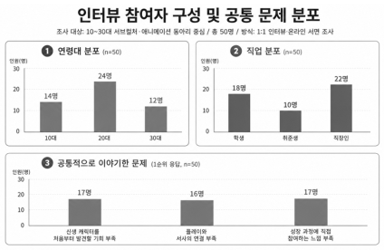

# 리듬게임을 클리어해야 다음 이야기가 열립니다

## V.E.L.O. 오컬트 아이돌 리듬게임 개발기

V.E.L.O.는 다섯 명의 신생 아이돌과 한 명의 
프로듀서가 다시 무대에 오르는 이야기입니다.

플레이어는 노래를 클리어하고 주차별 스케줄을 마치면서 
이들의 다음 이야기를 하나씩 열게 됩니다.

아직 완성된 게임도, 실제 플레이 평가도 없습니다. 
현재는 8명의 팀원이 생각을 맞춰가며 
MVP에서 검증할 질문을 구체화하는 단계입니다.

개발 과정을 지금부터 기록하는 이유가 있습니다. 
게임이 완성된 뒤 결과만 보여주기보다, 
아무도 모르는 다섯 아이돌의 탄생 과정을 
첫 팬들과 처음부터 함께 나누고 싶기 때문입니다.

---

## 유명한 아이돌을 좋아하는 것과 처음 발견하는 경험은 다릅니다

이 프로젝트는 리듬게임을 하나 더 만들겠다는 
단순한 생각에서 출발한 프로젝트가 아닙니다.

서브컬처와 아이돌 콘텐츠에는 이미 많은 해외 IP와 
오랫동안 사랑받은 캐릭터들이 존재하고 있습니다.

그러나 아직 이름도 알려지지 않은 한국형 가상 아이돌을 
데뷔 전부터 발견하고 성장에 참여하는 경험은 
상대적으로 찾아보기 어려운 상황이라고 판단했습니다.

V.E.L.O.가 만들고 싶은 것은 바로 이러한 경험입니다.

플레이어에게 다섯 멤버는 처음부터 유명한 스타가 아닙니다. 
무대도, 팬도, 안전한 미래도 없는 신인입니다.

플레이어는 이들이 바닥에서 출발해 조금씩 성장하는 
과정을 가장 가까운 곳에서 지켜보게 됩니다.

노래를 플레이하는 행위도 단순한 점수 경쟁이 아닙니다. 
다음 무대와 이야기를 가능하게 만드는 참여입니다.

---

## 게임을 정하기 전에 사람들의 이야기를 먼저 들었습니다

팀 대표자는 서브컬처·리듬게임·아이돌 팬덤 콘텐츠를 소비하며 
관련 게임 약 100개를 직접 조사했습니다.

하지만 레퍼런스의 기능과 흥행 요소를 정리하는 것만으로는 
플레이어의 실제 문제를 이해하기에 충분하지 않았습니다.

이에 서브컬처와 애니메이션에 관심 있는 50명을 대상으로 
1:1 인터뷰와 온라인 서면 조사를 진행했습니다.

조사에서는 세 가지 이야기가 반복적으로 등장했습니다.

첫째, 이미 팬덤이 완성된 작품보다는 처음부터 알아갈 
새로운 캐릭터를 만나고 싶다는 의견이었습니다.

> “이미 팬덤이 큰 작품도 좋지만, 이젠 처음부터 알아갈 수 있는 캐릭터가 없어서 아쉬워요.”

둘째, 플레이와 스토리가 분리되어 있다는 아쉬움이었습니다. 
게임은 계속하지만 이야기는 건너뛰게 되고, 
스토리를 보더라도 플레이가 서사적으로 연결되지 않았습니다.

> “게임은 하는데 스토리를 볼 이유는 없어서 스킵만 했어요.”

셋째, 완성된 캐릭터를 소비하는 것보다 성장 과정을 
가까이에서 지켜보고 싶다는 욕구가 있었습니다.

> “팔로우하고 소식을 챙겨보기 시작할 때 진짜 팬이 된 느낌이 들었어요.”

세 항목은 조사 기록에서 각각 17건, 16건, 
17건씩 공통적인 문제로 언급되었습니다.

이 결과가 전체 시장을 대표하는 것은 아닙니다. 
게임을 플레이한 뒤 받은 평가도 아닙니다.

다만 MVP를 만들기 전에 어떤 문제를 먼저 
확인할지 정하는 중요한 출발점이 되었습니다.

---

## 그래서 스토리와 리듬게임을 한 구조로 묶었습니다

V.E.L.O.는 리듬게임과 비주얼 노벨을 단순하게 
나란히 배치하는 데서 멈추지 않습니다.

두 콘텐츠가 서로의 진행을 이끌도록 만드는 것이 
V.E.L.O. 게임 구조의 가장 중요한 부분입니다.

플레이어에게는 주차별로 수행할 스케줄이 주어집니다. 
스토리를 감상하고 리듬게임을 플레이해 스케줄을 완료하면 
그다음에 이어지는 새로운 이야기가 해금됩니다.

따라서 리듬게임 클리어는 서사와 무관한 반복 과제가 
아니라 멤버들의 다음 무대를 여는 행동입니다.

팀은 캐릭터 성장과 플레이를 긴밀하게 연결한 
아이돌 게임들의 구조를 주요하게 살펴봤습니다.

그중 《앙상블스타즈》를 주요 레퍼런스로 참고했지만, 
기존 구조를 그대로 옮기지는 않았습니다.

V.E.L.O.의 세계관 안에서 플레이 자체가 하나의 
사건이 되도록 새로운 규칙을 설계했습니다.

그 결과 탄생한 장치가 ‘5+1 레인’입니다.

- 다섯 레인은 각각 아이돌 멤버와 연결됩니다.
- 여섯 번째 레인에는 공연을 보러 온 귀신이 내려옵니다.
- 귀신 레인에서 BAD가 나오면 즉시 실패할 수 있습니다.

여섯 번째 레인이 귀신인 이유는 명확합니다. 
V.E.L.O.의 관객은 살아 있는 사람만이 아니기 때문입니다.

---

## 모든 것을 빼앗긴 아이돌은 지하에서 다시 데뷔합니다

V.E.L.O.의 이야기는 대기업 엔터테인먼트에 모든 것을 빼앗긴 
다섯 연습생과 한 명의 프로듀서로부터 시작합니다.

이들은 회사의 시스템에서 버려지고 지하로 추락합니다. 
이승의 무대에 설 기회도 함께 사라집니다.

그 순간 이들은 예상하지 못한 관객을 만납니다. 
바로 새로운 무대를 찾아온 귀신들입니다.

다섯 멤버와 프로듀서는 귀신들과 ‘영혼의 스폰서십’을 맺고, 
자신들을 매장한 세계로 돌아갈 공연을 시작합니다.

> 대자본의 폭력에 모든 것을 빼앗기고 지하로 추락한 5인의 아이돌과 한 명의 프로듀서가, 귀신들과 영혼의 스폰서십을 맺고 아이돌의 정점을 향해 반격하는 이야기입니다.

오컬트는 겉모습만 장식하기 위한 콘셉트가 아닙니다. 
관객과 리듬게임의 기믹, 멤버들의 위기와 성장에 
모두 관여하는 이야기의 핵심 규칙입니다.

팀은 《케이팝 데몬 헌터스》의 사자보이즈가 보여준 
아이돌과 초자연적 존재의 결합을 참고했습니다.

여기에 지하 무대, 귀신 관객, 영혼의 스폰서십을 
더해 V.E.L.O.만의 인물과 세계를 만들고 있습니다.

V.E.L.O.는 해당 작품과 공식적인 관련이 없는 
독립적인 창작 프로젝트임을 분명하게 밝힙니다.

---

## 프로듀서는 왜 다섯 명을 데리고 탈주했을까요

다섯 멤버를 이끄는 프로듀서 P에게 이번 데뷔는 
새로운 직장이나 단순한 성공 프로젝트가 아닙니다.

P는 한때 대형 엔터테인먼트의 유능한 프로듀서였습니다. 
그러나 회사의 비인간적인 통제에 저항하던 첫 그룹이 
짓밟히고 해체되는 것을 끝내 막지 못했습니다.

그 과정에서 한 멤버를 잃는 비극까지 겪었습니다. 
P는 그 일을 자신의 무능 때문이라고 받아들이며 
오랫동안 지독한 죄책감을 안고 살아왔습니다.

그러던 중 P는 과거와 똑같이 회사의 희생양이 
될 위기에 놓인 다섯 연습생을 맡게 됩니다.

같은 일을 반복하지 않겠다고 결심한 P는 
자신의 커리어를 포기하고 멤버들과 회사를 나옵니다.

P의 표면적인 목표는 다섯 명을 누구도 부정할 수 
없는 아이돌의 정상에 세우는 것입니다.

그러나 그 안에는 과거에 대한 속죄와 자신들을 
짓밟은 시스템을 무너뜨리려는 집착도 존재합니다.

P와 멤버들은 제작자와 상품의 관계가 아닙니다. 
세상이 등을 돌린 순간 서로에게 남은 유일한 편이며, 
각자의 결핍으로 만들어진 가족에 가까운 관계입니다.

---

## 다섯 명은 무대 위에서만 완벽합니다

캐릭터의 매력은 설정표에 적힌 성격보다 관계 속에서 
더 분명하고 입체적으로 드러난다고 생각했습니다.

그래서 멤버를 개별적으로 설명하는 것만큼 서로 부딪히고 
의지하는 방식도 중요하게 설계하고 있습니다.

서윤과 미나는 무대 위에서는 누구보다 합이 좋지만, 
무대 밖에서는 끊임없이 충돌하는 관계입니다.

서윤의 낙천적인 태도를 미나는 생각 없는 
행동이라고 받아들이며 자주 부딪히게 됩니다.

하나와 지우는 나이와 역할이 뒤집힌 보호자 관계입니다. 
언니인 하나가 흔들릴 때마다 막내 지우가 
먼저 손을 내밀어 하나를 지켜줍니다.

리아는 완벽한 리더가 되고 싶어 하지만, 
예상하지 못한 순간에 허점을 보이는 인물입니다.

멤버가 힘들 때 가장 먼저 나서는 사람이며, 
프로듀서 P와도 감정적으로 가장 긴밀하게 연결됩니다.

이 관계들이 실제 이야기에서도 재미있게 작동할지는 
아직 검증하지 못한 중요한 질문입니다.

설정을 많이 썼다는 사실이 곧바로 캐릭터의 
매력을 증명해 주는 것은 아니기 때문입니다.

MVP에서는 플레이어가 누구를 기억하고 어떤 관계에 
반응하는지 실제 플레이를 통해 확인하려 합니다.

---

## 지금 팀이 확인해야 할 것은 세 가지입니다

현재 V.E.L.O.는 프리-MVP 단계에 있는 프로젝트입니다. 
8명의 팀원이 비주얼 노벨과 리듬게임, 자체 아이돌, 
오컬트 세계관을 하나의 경험으로 묶고 있습니다.

첫 번째 MVP에서는 다음 가설을 확인하려 합니다.

1. 스토리가 다음 장면을 궁금하게 만들고, 멤버들의 개성이 구분되어 보이는가.
2. 이야기와 리듬게임 음악이 자연스럽게 어울리며 몰입을 높이는가.
3. 첫 플레이 후에도 다음 스케줄과 이야기를 위해 다시 플레이하고 싶은가.

MVP의 데모 음악에는 생성형 AI 도구를 활용합니다. 
적은 자원으로 곡의 분위기와 서사의 결합을 
빠르게 확인하기 위한 제작 방식입니다.

어떤 도구를 사용해 어떻게 제작했는지 공개하고, 
AI를 활용했다는 사실도 숨기지 않을 계획입니다.

가설이 틀릴 가능성도 충분히 열어두고 있습니다. 
관계가 복잡하기만 하고 기억에 남지 않거나, 
귀신 레인이 긴장감보다 피로감을 줄 수도 있습니다.

스토리를 해금하기 위한 플레이가 오히려 강제처럼 
느껴지는 문제도 발생할 수 있습니다.

MVP는 이러한 위험을 감추기 위한 결과물이 아닙니다. 
가장 중요한 질문을 작은 형태로 확인하는 도구입니다.

---

## 첫 팬을 만나는 과정도 게임의 일부입니다

현재 V.E.L.O.에는 화려한 플레이 영상도, 
실제 이용자가 남긴 플레이 평가도 없습니다.

대신 어떤 문제에서 출발했고 왜 이러한 구조를 
선택했으며, 무엇을 모르는지부터 기록하려 합니다.

앞으로 캐릭터가 설정에서 장면으로 바뀌는 과정과 
6키 기믹의 테스트 결과를 공개할 예정입니다.

데모 음악과 스토리를 맞추는 시행착오, 
첫 MVP에서 받은 반응도 순서대로 기록하겠습니다.

다섯 아이돌은 아직 인지도 0에서 출발합니다. 
누군가 한 멤버의 이름을 기억하고 다음 소식을 
궁금해한다면 첫 팬의 경험은 이미 시작된 것입니다.

V.E.L.O.의 첫 팬이 되는 과정에 함께해 주시기 바랍니다.

---

**프로젝트 단계:** 프리-MVP 
**개발 인원:** 8명 
**장르:** 스토리 해금형 아이돌 리듬게임·비주얼 노벨 
**핵심 소재:** 한국형 신생 가상 아이돌, 오컬트, 귀신 관객 
**조사 대상:** 서브컬처·애니메이션 관심자 50명 
**조사 방식:** 1:1 인터뷰 및 온라인 서면 조사
